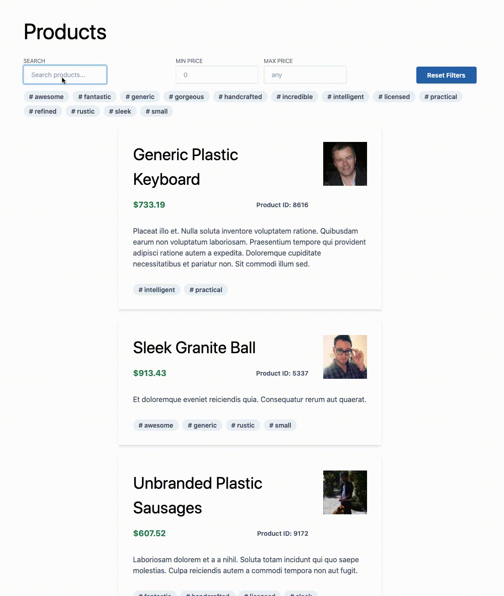

# Product List/Feature Page

> Practising some new (to me) tools

> as at 9th may

## Features

- focus on accessibility
- `useContext`, `useMemo` combined into custom hook for applying search highlighting/styles on any text in the app
- custom hook for ensuring consistent behaviour of product tag state even when rendered by different parents. Allows tag filtering to be initiated from product card, not just filters component
- hook to provide unique ID for inputs/associated labels for accessibliity
- first real adventure with TypeScript
- beginning of little tailwind-powered design system, e.g. `<Input />` `<Button />`
- tests via testing-library/react

## Using

- Create React App incl. TypeScript
- Tailwind css
- testing-library
- faker
